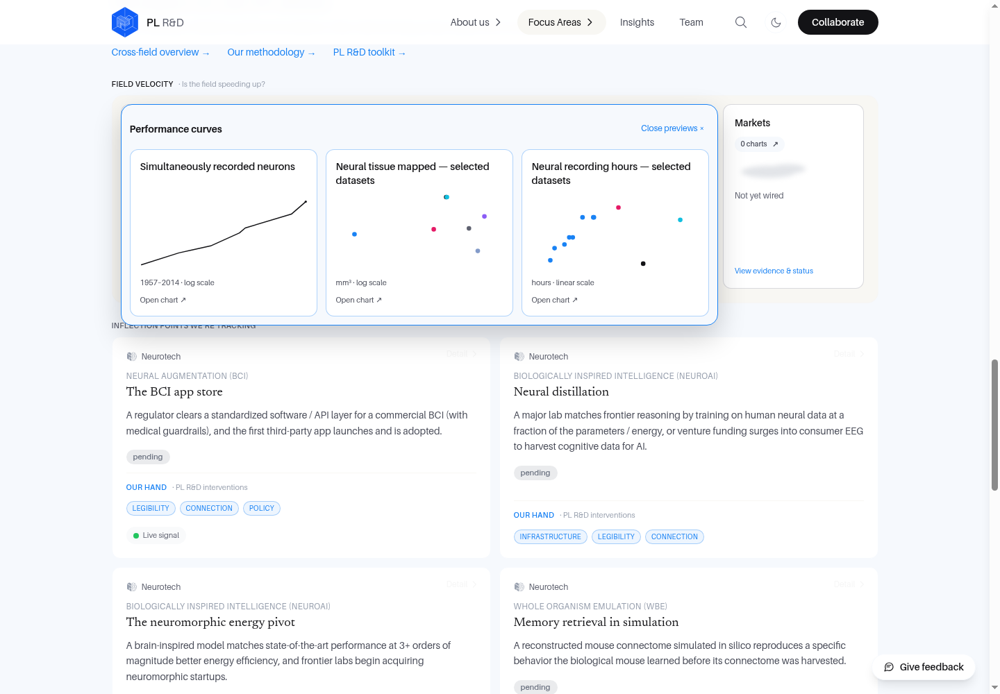
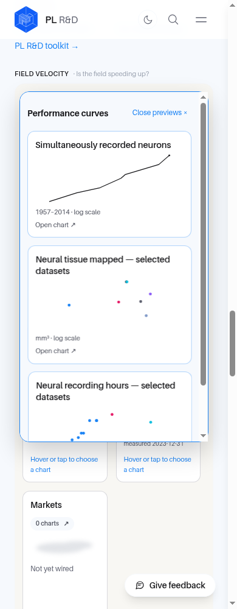
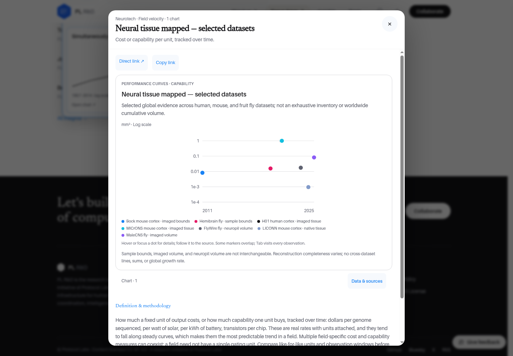
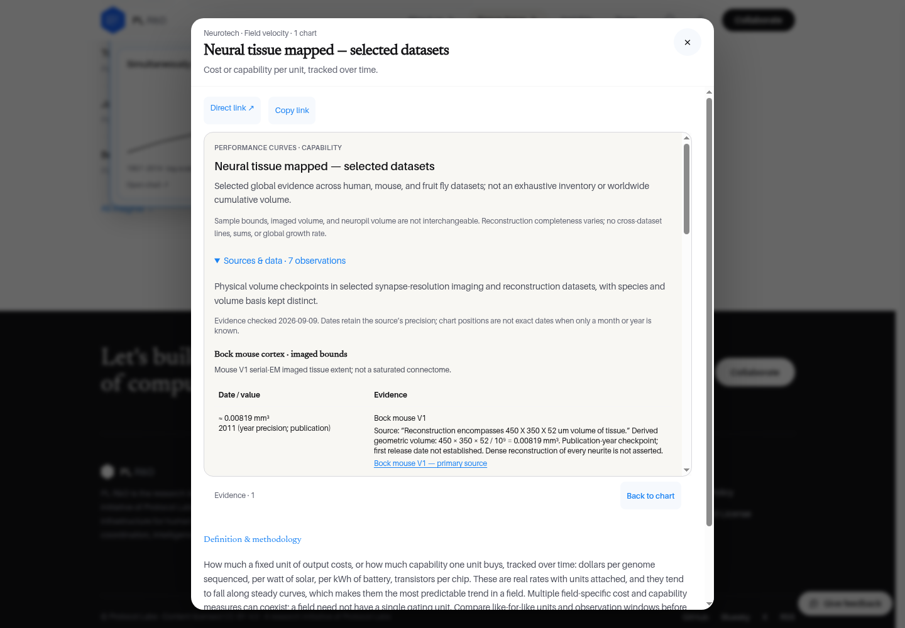
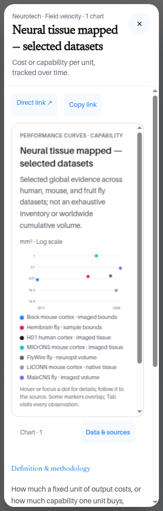

# Individually selectable chart decks — verification

Application revision: `973291ff011742e2b6d723ac131354208b7c6cad`.

## Behavior

Hover or keyboard focus spreads real, titled chart previews in place. Each selection opens only its own chart and has a stable fragment URL, Direct link, and Copy link. Touch uses tap to spread, then tap to select. PLRD's two-sided animated chart/source cards remain intact. The selected chart is above the always-visible methodology.

## Evidence

- Full velocity test suite: 59 passing tests; TypeScript and production build pass.
- Hover selection matrix: 63 selections at 1440, 390 and 320px across all four overview areas and the Neuro detail route. The fan implementation is unchanged in the later modal-layout corrections.
- Final application replay: all 21 distinct chart URLs open directly and copy their exact URL using the real browser clipboard.
- Final desktop/390/320px checks cover Back/Forward, keyboard-focus expansion and background geometry **while the modal is open**, not just after closing.
- Actual intermediate fan transforms, reduced-motion behavior, native touch input and two-way 3D flips were exercised. Inactive card faces stay inert.
- Data modules and dependency lockfiles are unchanged by this follow-up.

Fresh skeptical review caught and fixed a minimum-width-body scrollbar compensation error at 320px and methodology pushing the selected chart below the initial viewport. Both have regression tests and browser replays. Review verdict: **PASS for this PR update**, not permission to merge/publish.

Captures are from the local production build, not a claim of a production deployment. The overview's pre-existing viewport-width breakout adds about 8px of page overflow at desktop; the selection matrix checks for **new** overflow and separately checks each spread/target against the actual viewport. That pre-existing page-shell issue was not changed in this scoped follow-up.

## Screenshots

### Desktop spread

### Mobile touch selection

### Selected chart, before methodology

### Source/data face

### 320px modal

