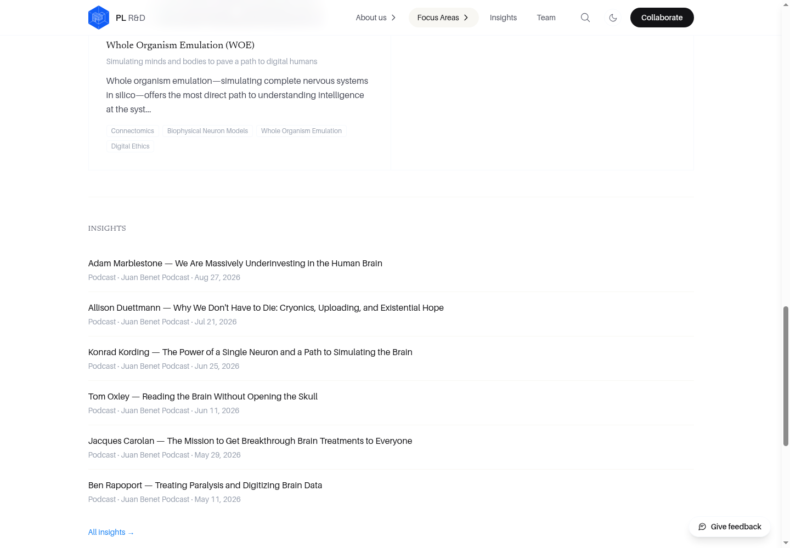
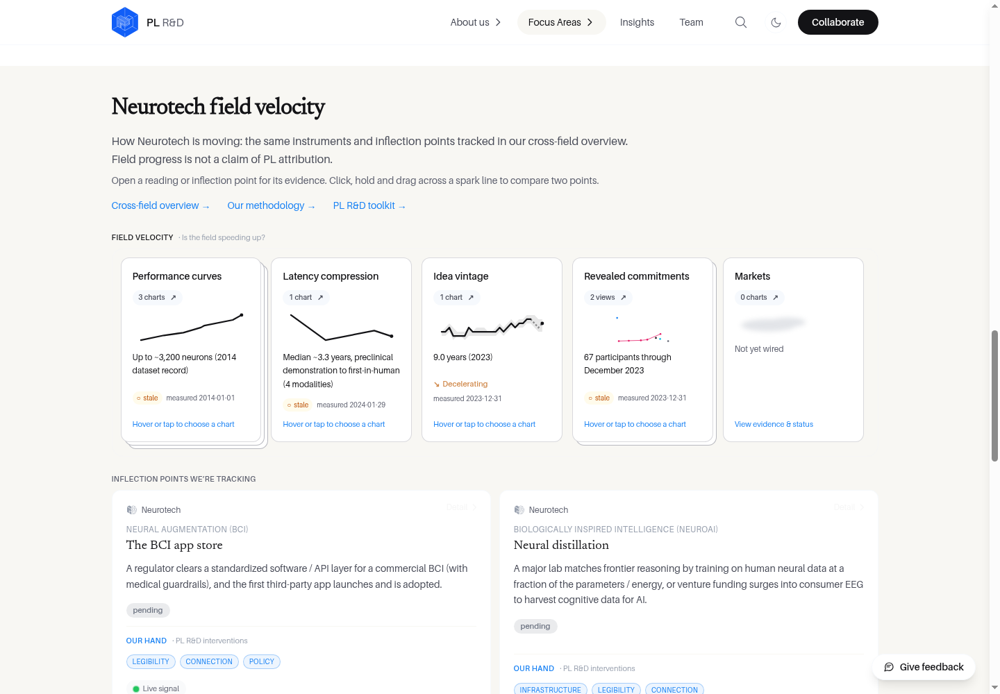
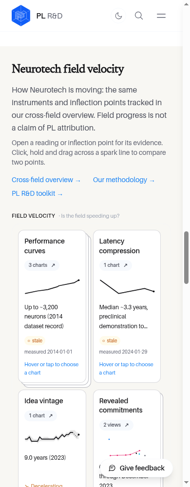
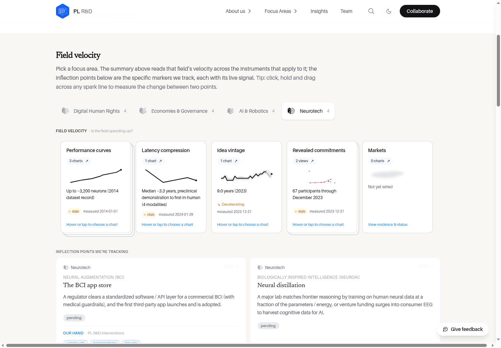

# Field-velocity launch boundary

Two deliberately separate changes:

1. **Hide now:** remove the `AreaFieldVelocity` import and mount from both public focus-area page templates (the generic template and the hardcoded Economies & Governance route). No CSS-only hiding, public preview-discovery links, data loading, or chart-fragment dialogs remain on those pages. The reusable component stays staged in source for restoration.
2. **Restore later:** a separate draft PR reverses only that public-detail wiring and restores the original positive mounting tests. It does not publish `/impact/`, change navigation, or promote the cross-field preview. Merge the hiding PR first; the restore PR is stacked on its branch and must target `main` after the hiding PR merges. Do not merge the restore PR into the hiding branch.

The cross-field page remains at `/impact-preview-eb61fba1b98e/`, with all four areas, chart deep links, source faces, inflections, methodology and toolkit. Its `noindex,nofollow` metadata and exclusions from navigation, sitemap, search, RSS and robots discovery remain unchanged. The read-only field-velocity API/data are preserved for consumers. Unlisted/noindex is not authentication or access control.

This is distinct from the older draft PR #105, which would promote `/impact/` into navigation. That PR is not changed by either detail-page visibility PR.

## Verification (September 10, 2026)

Application revisions exercised:
- Hidden: `7e696f9b64aba340c4aa15b374e1c1c23d320ed5` — 79 tests passing.
- Restored: `e426c490736f055794428e39733b160c31de295b` — 75 tests passing.
- The restored `src` tree is exactly the pre-hide main/PR153 tree at `cea75883bbed07cb751a3bc17c5b677cfa587b74` (tree `61229e854adeb104781b01b0747df0027898d1c4`). No other source, styling, data, API or site changes.

Both passed pnpm 10 frozen installs, TypeScript and production builds, plus independent isolated code reviews. Test-first regressions failed on all four public routes before hiding; the original mounting tests failed on all four hidden routes before restoring.

Headed local production-build browser checks at 1440, 390 and 320px:
- All four public detail routes preserve Opportunity Spaces and their existing Insights/Explore content.
- Hidden state has zero field-velocity panels, tiles, preview-discovery links or old `#fv/...` chart dialogs.
- Restored state has the field panel, all five tiles, three overview/methodology/toolkit links and working old chart fragments.
- All four selected cross-field overview tabs retain five tiles and methodology. A real chart URL per field opens its modal; the data/source flip and Escape dismissal work.
- 24 route/viewport cases per state, 48 across both. Screenshots below are local captures of these real source revisions, not claims about production deployment.

36 HTTP checks across both local production builds cover home, area index, all four detail routes, the exact preview, sitemap, robots, search, RSS, each field API, malformed API area, and missing `/impact/` and `/field-velocity/` routes.

## Existing limitations, not changed by these PRs

- Both states produce exactly the same measured horizontal overflow: 8px on the unchanged cross-field preview at 1440/390px; 15px at a 320px viewport with a native scrollbar (the site's existing 320px body minimum). Public detail pages have no horizontal overflow at 1440/390px. These visibility changes do not attempt a preview layout redesign.
- Builds report existing provider fallback/cache warnings (including Ma Earth snapshot fallback and indexer GraphQL errors). No new provider integration or data freshness is claimed.
- The production URL was inspected through HTTP extraction. The authenticated Chrome policy blocked direct `www.plrd.org` navigation; visual evidence uses local production builds, with hosted PR deployment verification reported separately in the PR descriptions.

## Screenshots

### Hidden public detail: desktop

### Hidden public detail: mobile

### Exact pre-hide detail behavior restored: desktop

### Exact pre-hide detail behavior restored: mobile

### Cross-field preview retained

