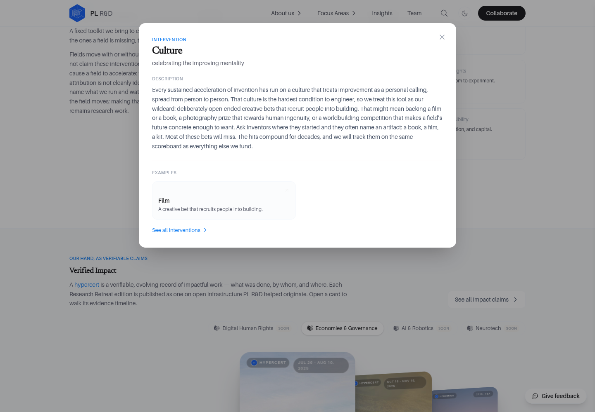
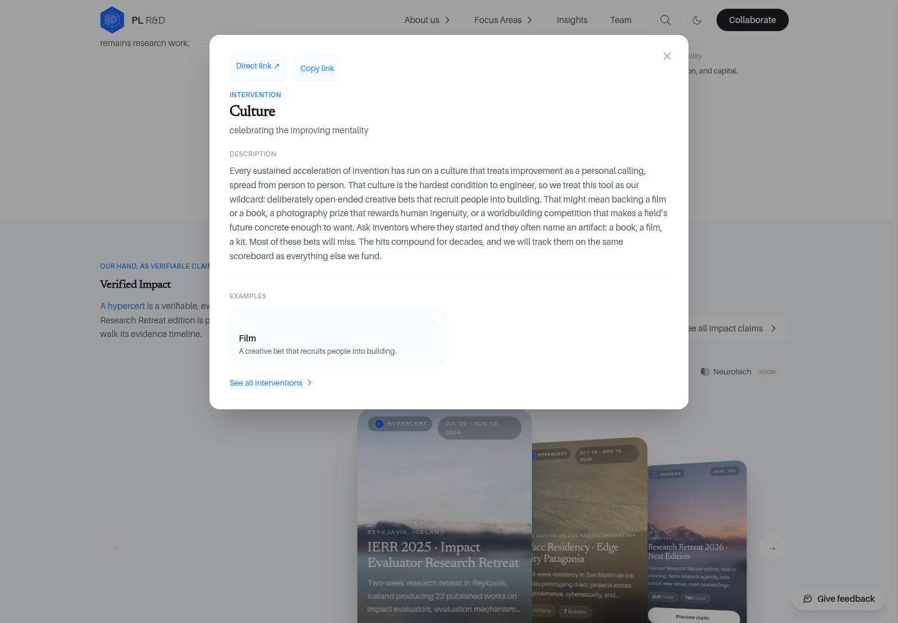
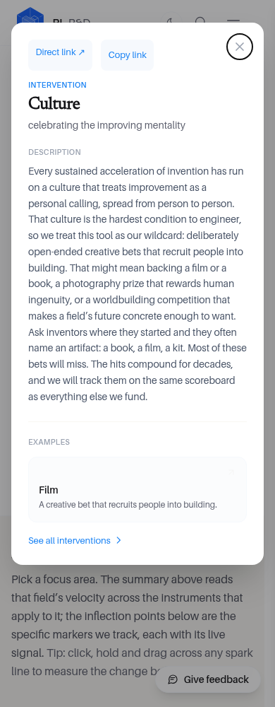
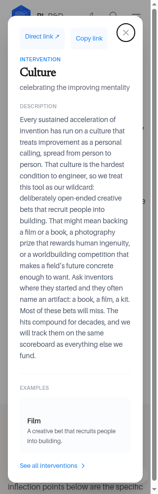
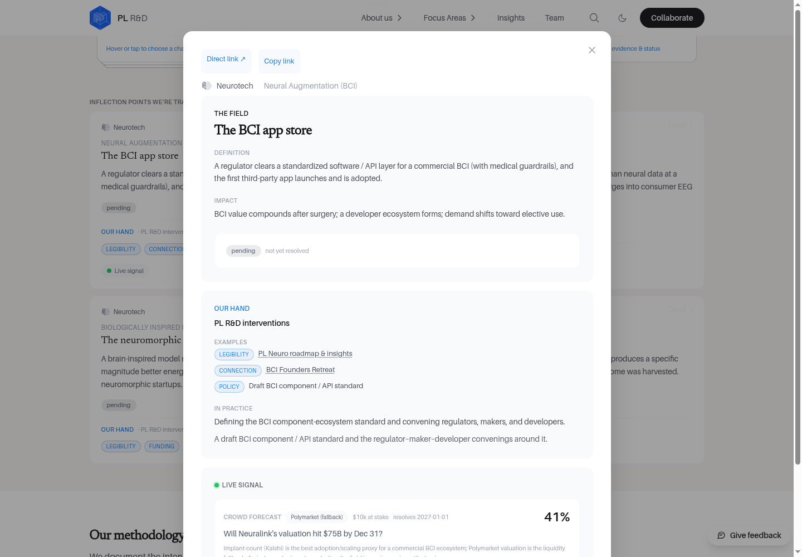

# Impact Preview deep links — verification

## Scope

The existing unlisted `/impact-preview-eb61fba1b98e/` route now addresses its pop-outs and section headings. This is **not** publication of `/impact` and does not restore field-velocity mounts on public focus-area pages.

- Seven interventions: `#intervention/culture` (and the six other toolkit IDs).
- Six definitions: e.g. `#definition/performance_curves`.
- Sixteen inflections: e.g. `#inflection/neurotech/ip-the-bci-app-store`.
- Six section anchors: `#field-velocity`, `#methodology`, `#toolkit`, `#observed-velocity`, `#inflection-points`, and conditional `#verified-impact`.
- Existing `#fv/…` charts/area selection and legacy hypercert fragments remain supported.

Opening a pop-out updates the URL without a page navigation. Direct/Copy controls preserve origin, path, and queries. When a methodology/section fragment replaces an area-bearing chart fragment, the selected area is retained in `?area=`. Back/Forward restores the view; closing a fresh link remains on this page. Unknown fragments do not open a dialog.

## Executed verification

Runtime/source revision: **`3262dae0e2da0b74f4389fb2837f998789218f5b`**. Screenshots and browser receipts below were captured from its isolated **local production build**, not the hosted site. The documentation-only evidence commit retains that exact runtime tree.

- `pnpm@10 install --frozen-lockfile` passed; both lockfiles unchanged.
- `npm test`: **104 passed, 0 failed**.
- `tsc --noEmit` and the production build passed.
- **68 main browser cases**, including every one of the 29 new pop-out URLs: click → URL → close, all fresh URLs and exact clipboard readback; representative 390px/320px fresh-link/focus checks; malformed fragments. All 29 triggers were reconciled against an independent pre-change inventory.
- **11 additional browser cases**: chart/definition/Culture switching, legacy cert history and ordinary cert opening from a section, all six section anchors, visible Close and backdrop dismissal.
- Modal focus containment, trigger restoration, browser Back/Forward, and background scroll checks passed. The narrow viewport widths were emulated in the real browser; this is not a physical-device test.
- Content/data definitions, public mounts, navigation/discovery exclusions, and noindex metadata remain unchanged. Live pre-change HTTP checks confirmed the preview is noindex and the four public focus-area pages have no field-velocity mounts/discovery links.

### Scroll regression caught in the browser

At the document bottom, the existing full-bleed band creates a horizontal scrollbar. Hiding overflow increased viewport height by 15px and clamped the background scroll. URL-history dismissal retained that clamped position. The modal lock now reserves the lost scrollbar height, restores native layout after width compensation, and only then removes the height reservation. The regression test went red before each part of the fix; the complete browser replay then passed without relaxing the scroll assertion.

## Screenshots

Before: Culture opened with an unchanged URL and without modal focus containment (baseline `f7006e9`).

After: Culture at 1440px, opened through the toolkit card; Direct/Copy controls are visible.

Fresh Culture links at 390px and 320px, with focused Close, share controls, and readable wrapping.

Neurotech inflection detail opened from its card with its own shareable URL.

